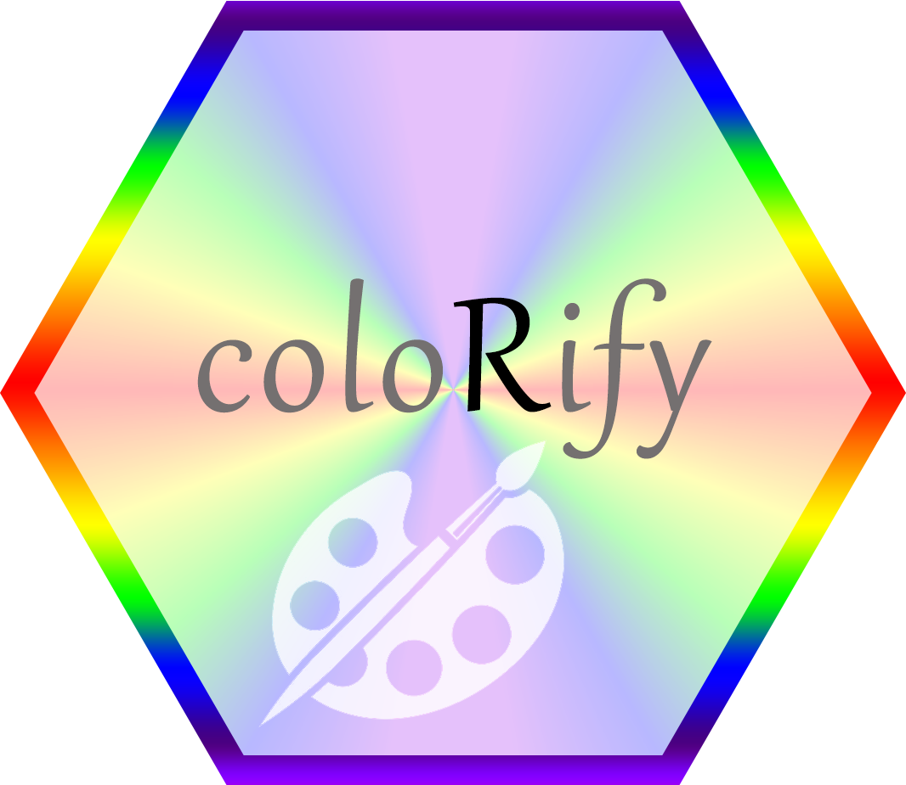

<!-- README.md is generated from README.Rmd. Please edit that file -->

<!-- badges: start -->

[](https://www.repostatus.org/#active)
[](https://lifecycle.r-lib.org/articles/stages.html#stable)
[](https://opensource.org/license/apache-2-0)


<!-- badges: end -->

# coloRify 

Are you, like me, tired of errors complaining *you need more colors than
your palette contains*? No problem!

🌈 Colorify makes color creation and modification intuitive and
effortless. Colorify is dependency-free yet combines functionality of
popular color and visualization packages, including:

- viridis palettes, that are perceptually uniform and
  colorblind-friendly: Viridis, Turbo, Inferno, Cividis, Plasma, Rocket
  & Mako.
- Rcolorbrewer palettes and inspired palette visualization.
- ggplot2 easy-to-use integration of scale_color\_\* and scale_fill\_\*
  bindings.
- base R (grDevices) palettes: Rainbow, Heat, Terrain, Topo, Cm & all
  hcl/pal palettes.
- Okabe-Ito palette, for a highly distinct and colorblind-safe scheme.

But… I already have my own cool color palettes! Why should I need
Colorify? Colorify can make your colors even ***COOLOR***✨! By slightly
adjusting hue, saturation, brightness or by nudging individual RGB
channells your visualizations become more vibrant and clear! A bit of
HSL/RGB knowledge goes a long way toward crafting perfectly balanced and
visually distinct color palettes. Simply drop in your own colors and
palettes or pick them from the overview, Colorify automatically
generates maximally different colors as need by.

🌈 Colorify also lets you…

- Create color gradients between palette or custom colors
- Map color gradients to specific value ranges
- Build color functions when plots generette colors dynamically
- Convert from HSV/hexcolor to RGB color space

Feeling fancy? Free your inner artist and express yourself with
coloRtistry!

# Installation

Colorify will become available on CRAN, the development version is
available here.

``` r
## coloRify installation requires R version >4.3, to download and install visit:
# R: https://cran.r-project.org/mirrors.html

## To install coloRify from CRAN, once available, use:
install.packages('colorify')
# or via pak
pak::pkg_install('colorify', dependencies = TRUE, upgrade = TRUE)
```

# Running colorify - vignette - examples

See the
[vignette](https://mauritsunkel.github.io/colorify/colorify.html) for
details and examples.

# Contact

A thank you for your time and effort in using coloRify, I hope it may
aid you in coloRifying your data!

For issues: <https://github.com/mauritsunkel/colorify/issues>

To collaborate, pull request or email me: <mauritsunkel@gmail.com>
